# ⚡ NetForge — Autonomous Reliability Agent

> **An AI-powered SRE platform that predicts, prevents, and auto-remediates microservice failures — powered by a dual-model agent architecture on AWS Strands + MiniMax.**

---

## 🏆 Hackathon Tracks

| Track | Integration |
|-------|-------------|
| **AWS** | AWS Strands Agents, ECS, CodeDeploy, SSM |
| **Datadog** | Datadog MCP Server, LLM Observability, live metric pipelines, monitor alerts |
| **Neo4j** | Graph-native topology via **Neo4j MCP Server**, blast-radius analysis, deployment audit graph |
| **TestSprite** | Automated network stability validation pre/post every scale event |
| **CopilotKit** | Embedded AI co-pilot sidebar wired directly to the Strands agent via SSE + AgentCore |
| **MiniMax** | MiniMax M2.5 as a background reasoning sub-model (async deep-pattern analysis) |

---

## 🧠 What is NetForge?

NetForge is a **production-ready autonomous reliability platform** for microservice environments. Instead of dashboards that require humans to interpret and act, NetForge runs an AI agent that:

1. **Sees everything** — live Datadog metrics, Neo4j service topology, deployment history, container health
2. **Understands causality** — traces cascading latency through the dependency graph to find the *deepest* root cause
3. **Acts autonomously** — scales ECS services, rolls back CodeDeploy deployments, updates SSM parameters — choosing the least invasive fix first
4. **Validates recovery** — runs TestSprite network stability tests automatically after every remediation
5. **Remembers and learns** — persistent memory stores every insight and detected pattern, making future analyses smarter
6. **Explains itself** — CopilotKit sidebar lets you talk to the agent in natural language at any time

---

## 🏗️ Architecture

```mermaid
flowchart TD
    User(["👤 User / Judge"])

    subgraph Frontend["🖥️ Frontend — React + D3 + CopilotKit"]
        UI["D3 Force Graph\nService Topology"]
        Sidebar["CopilotKit AI Sidebar\nNatural Language Chat"]
        InsightsPanel["Insights Panel\nPatterns · Recommendations"]
    end

    subgraph Backend["⚙️ Backend — FastAPI"]
        API["REST + SSE API\n/api/agent  /api/hooks\n/copilotkit  /api/insights"]
    end

    subgraph Agent["🤖 Strands Agent — MiniMax"]
        Orchestrator["Main Orchestrator\nTool Calls · Analysis · Remediation"]
    end

    subgraph BgModel["🔮 Background Sub-Model"]
        MiniMax["MiniMax M2.5 via LiteLLM\nasyncio.create_task — 60s timeout guard\nDeep Pattern Analysis"]
        Memory["Persistent Memory\nInsights · Patterns · Baselines"]
        MiniMax -->|"store [MiniMax] tags"| Memory
    end

    subgraph Tools["🛠️ Agent Tools"]
        DD["Datadog MCP Server\n+ 6 Direct REST Tools\nMetrics · Events · Monitors"]
        Neo4j["Neo4j Graph DB\nTopology · Blast Radius\nDeployment Audit"]
        AWS["AWS Tools\nECS Scale · CodeDeploy\nSSM Parameters"]
        TS["TestSprite\nRecovery Validation\nScale Stability Tests"]
        MemTools["Memory Tools\nRecall · Store · Recommend"]
    end

    User -->|"click node / chat"| Frontend
    Frontend <-->|"REST / SSE"| Backend
    Backend <-->|"invoke"| Agent
    Orchestrator -->|"tool calls"| DD
    Orchestrator -->|"tool calls"| Neo4j
    Orchestrator -->|"tool calls"| AWS
    Orchestrator -->|"tool calls"| TS
    Orchestrator -->|"tool calls"| MemTools
    MemTools <--> Memory
    Orchestrator -->|"fire-and-forget"| MiniMax

    style Frontend fill:#0e1e34,stroke:#3a5a7a,color:#c8daf0
    style Backend fill:#0e1e34,stroke:#3a5a7a,color:#c8daf0
    style Agent fill:#0d2040,stroke:#7b61ff,color:#c8daf0
    style BgModel fill:#0d1f30,stroke:#f5a623,color:#c8daf0
    style Tools fill:#091828,stroke:#1e3a5a,color:#c8daf0
```



### Model Design

**MiniMax — Main Orchestrator**
- Handles all tool calls, analysis, and user-facing responses
- Runs the full mandatory workflow: check memory → Datadog alerts → Neo4j graph → root cause → remediation → validation → store insight
- Streams responses to the CopilotKit sidebar via Server-Sent Events

**MiniMax M2.5 — Background Sub-Model**
- Fires asynchronously via `asyncio.create_task()` after every orchestrator response
- Performs deeper pattern analysis and predictive reasoning on the main report
- Protected by a 60-second timeout guard — failures never propagate to the user
- Stores enriched insights and patterns tagged `[MiniMax]` in persistent memory

---

## 🔗 Integration Details

### MiniMax + Strands Agents
- `strands-agents` framework powers the orchestrator agent
- Model: MiniMax via `LiteLLM`
- Agent executes 20+ tools across Datadog, Neo4j, AWS, TestSprite, and memory

### Datadog MCP + Direct REST
- **MCP Server**: `@winor30/mcp-server-datadog` launched as a stdio subprocess — gives the agent native MCP tool access to Datadog search, events, and monitors
- **Direct REST tools**: 6 custom Datadog tools using the REST API directly for webhook use-cases (faster, no subprocess)
  - `get_datadog_monitor_alerts` — firing monitors ranked by severity
  - `get_datadog_metrics_summary` — aggregated metric health across 2,944 metrics
  - `query_datadog_metric` — time-series deep dives on specific metrics
  - `get_datadog_infrastructure_health` — host/container infrastructure overview
  - `get_datadog_events` — OOMKills, K8s deployment events, pod failures
  - `get_datadog_container_metrics` — CPU/memory per container
- Connected to a real Datadog account monitoring a Shopist AKS e-commerce platform (2,944 active metrics, 1000+ events/hour)

### Neo4j Graph Database
- **Neo4j MCP Server**: Provides native graph traversal and Text2Cypher capabilities, allowing the agent to query complex infrastructure patterns, perform blast-radius analysis, and verify deployment safe-guards.
- **Deployment audit**: Every deployment creates a `Deployment` node linked to the service via `HAD_DEPLOYMENT`
- **Graph-powered tools**:
  - `get_service_dependencies` — traverses dependency chains
  - `get_blast_radius` — counts upstream services affected by a failure
  - `find_slowest_dependencies` — identifies latency bottlenecks
  - `find_recent_changes` — queries deployments in the last N hours
  - `get_service_health_from_graph` — reads live health properties on nodes
- Datadog sync webhook writes live metrics back into Neo4j properties every sync, keeping the graph fresh

### TestSprite
- Validates service recovery after every remediation action
- **Scale stability pipeline** (`POST /api/hooks/scale`):
  1. Records pre-scale baseline (Phase 1)
  2. Executes `scale_ecs_service`
  3. Waits for stabilization window
  4. Runs post-scale network stability test (Phase 2)
  5. If `network_stable: false`, automatically stores a `reliability` insight with the delta metrics
- Tools: `validate_service_recovery`, `validate_scale_stability`

### CopilotKit
- Frontend wrapped in `<CopilotKit runtimeUrl="http://localhost:8000/copilotkit">`
- Backend implements the AG-UI SSE protocol at `POST /copilotkit` using **AgentCore**
- `useCopilotReadable` hooks inject live context (degraded services, selected node, insights) so the AI knows what's on screen
- `useCopilotAction` hooks allow the agent to trigger UI actions directly

### MiniMax M2.5
- Integrated via `LiteLLMModel` with the `openai/MiniMax-M2.5` model ID
- Lazy-initialized singleton to avoid startup latency
- `<think>...</think>` tokens stripped from output before JSON parsing
- Async with 60s timeout: if MiniMax is slow, the main response is already delivered

---

## 🖥️ Frontend

The React + TypeScript dashboard is a **real-time ops center**:

- **D3 Force-Directed Graph** — live service dependency visualization with health-colored nodes, glow filters, and animated critical-path pulse effects
- **Health polling** — fetches `GET /api/agent/health` every 5 seconds to update node colors in-place without layout jumps
- **CopilotKit AI Sidebar** — click any node → agent immediately runs a full analysis; or ask anything in the sidebar chat
- **Insights Panel** — paginated view of all stored insights, patterns, and optimization recommendations with acknowledge/resolve actions
- **Cluster Panel** — simulate load scenarios and watch the MAPE-K control loop respond in real time
- **Remediation Feed** — live log of every agent action (scale, rollback, SSM update) with timestamps

---

## 🚀 Quick Start

### Prerequisites
- Python 3.11+
- Node 18+ (npm)
- Neo4j Aura free tier
- MiniMax API credentials (or set `DEMO_MODE=true`)

### 1. Clone & Configure

```bash
git clone https://github.com/Pranav301102/NetForge
cd NetForge
```

Copy and fill in credentials:

```bash
cp backend/.env.example backend/.env
```

```env
# Default Region
AWS_REGION=us-east-1
AWS_ACCESS_KEY_ID=your_key
AWS_SECRET_ACCESS_KEY=your_secret

# Datadog MCP
DATADOG_API_KEY=...
DATADOG_APP_KEY=...
DATADOG_SITE=datadoghq.com

# Neo4j (Aura)
NEO4J_URI=neo4j+s://your-instance.databases.neo4j.io
NEO4J_USER=neo4j
NEO4J_PASSWORD=...

# TestSprite
TESTSPRITE_API_KEY=...

# MiniMax (background sub-model)
MINIMAX_API=sk-...

# Set true to bypass API calls (uses rich demo data)
DEMO_MODE=false

FRONTEND_URL=http://localhost:3000
```

### 2. Start Neo4j (Docker)

```bash
docker-compose up neo4j -d
```

Or use the hosted Neo4j Aura instance already configured in `.env.example`.

### 3. Start the Backend

```bash
cd backend
bash start_demo.sh
# → API: http://localhost:8000
# → Demo UI: http://localhost:8000/demo
# → API Docs: http://localhost:8000/docs
```

Or manually:

```bash
cd backend
python3 -m venv .venv && source .venv/bin/activate
pip install -r requirements.txt
uvicorn api.main:app --reload --host 0.0.0.0 --port 8000
```

### 4. Start the Frontend

```bash
cd frontend
npm install
npm start
# → http://localhost:3000
```

### 5. Seed Demo Data (Optional)

```bash
# Trigger full insight generation across all services
curl -X POST http://localhost:8000/api/insights/generate

# Sync live Datadog metrics into Neo4j
curl -X POST http://localhost:8000/api/hooks/datadog-sync \
  -H "Content-Type: application/json" -d '{}'

# Simulate a degradation event to watch the agent respond
curl -X POST "http://localhost:8000/api/agent/simulate/degrade?service=payment-service"
```

---

## 📡 API Reference

| Method | Endpoint | Description |
|--------|----------|-------------|
| `POST` | `/api/agent/analyze` | Full AI agent analysis of a service |
| `GET`  | `/api/agent/health` | Health scores for all services (5s poll target) |
| `POST` | `/api/agent/chat` | Streaming SSE chat with the agent |
| `GET`  | `/api/graph/` | Service graph (nodes + links) |
| `GET`  | `/api/graph/deployments/recent` | Recent deployments |
| `GET`  | `/api/insights/` | All stored AI insights |
| `GET`  | `/api/insights/patterns` | Detected cross-service patterns |
| `GET`  | `/api/insights/recommendations` | Actionable optimization recommendations |
| `POST` | `/api/insights/generate` | Trigger AI insight generation |
| `POST` | `/api/hooks/deploy` | Deployment webhook → async analysis |
| `POST` | `/api/hooks/datadog-sync` | Pull live Datadog metrics → Neo4j |
| `POST` | `/api/hooks/scale` | Scale service + TestSprite stability test |
| `GET`  | `/api/cluster/status` | Cluster health and replica state |
| `POST` | `/api/cluster/simulate-load` | Simulate traffic load for demo |
| `POST` | `/api/cluster/tick` | Advance MAPE-K control loop one tick |
| `GET`  | `/copilotkit` | CopilotKit agent discovery |
| `POST` | `/copilotkit` | CopilotKit SSE chat stream |

---

## 🎬 Demo Flow (for Judges)

1. **Open** `http://localhost:3000` — the D3 dependency graph loads with live health data from Neo4j
2. **Click any service node** — the agent immediately runs a full analysis, updating the annotation bar with the summary
3. **Open the Insights tab** (right panel) → click **"Generate Insights"** to watch MiniMax analyze all services
4. **Use the CopilotKit sidebar** — ask: *"Why is order-service degraded and what should I do?"*
5. **Trigger a scale event** via cURL (or the cluster panel) and watch TestSprite validate network stability
6. **Simulate degradation**:
   ```bash
   curl -X POST "http://localhost:8000/api/agent/simulate/degrade?service=payment-service"
   ```
   Then click `payment-service` on the graph to watch the full remediation cycle
7. **Sync Datadog** to pull live Kubernetes/AKS container metrics into the graph:
   ```bash
   curl -X POST http://localhost:8000/api/hooks/datadog-sync -H "Content-Type: application/json" -d '{}'
   ```

---

## 🏛️ MAPE-K Autonomic Control Loop

NetForge implements the classical MAPE-K feedback loop for self-healing:

| Phase | Implementation |
|-------|---------------|
| **Monitor** | Datadog MCP + direct REST (metrics, events, monitor alerts) + Neo4j health polling |
| **Analyze** | Strands Agent orchestrated by MiniMax — root cause tracing through the Neo4j dependency graph |
| **Plan** | MiniMax selects least-invasive action: SSM param update → scale up → rollback |
| **Execute** | `scale_ecs_service`, `trigger_codedeploy_rollback`, `update_ssm_parameter` |
| **Knowledge** | Persistent JSON memory — insights, patterns, baselines — enriched in background by MiniMax M2.5 |

---

## 🧪 Test Results

From `test_connection.py` (4/4 passing):

| Test | Result | Details |
|------|--------|---------|
| Environment variables | ✅ | All 9 keys loaded |
| MiniMax M2.5 | ✅ | ~4.0s response |
| Neo4j | ✅ | 10 services found |
| Full analysis | ✅ | 54.3s — MiniMax ran 8 tool calls, MiniMax enriched memory async |

---

## 📁 Project Structure

```
NetForge/
├── backend/
│   ├── agent/
│   │   ├── agent.py          # Dual-model orchestrator (MiniMax)
│   │   ├── models.py         # Pydantic models
│   │   └── tools/
│   │       ├── aws_tools.py      # ECS scaling, CodeDeploy rollback, SSM
│   │       ├── datadog_tools.py  # 6 direct Datadog REST tools
│   │       ├── neo4j_tools.py    # Graph traversal tools
│   │       ├── testsprite.py     # Recovery + scale stability validation
│   │       └── memory_tools.py   # Persistent insight/pattern storage
│   ├── api/
│   │   ├── main.py               # FastAPI app + CopilotKit endpoint
│   │   └── routes/
│   │       ├── agent_routes.py   # Analyze, chat, health
│   │       ├── hooks_routes.py   # Deploy webhook, Datadog sync, scale
│   │       ├── insights_routes.py
│   │       ├── graph_routes.py
│   │       └── cluster_routes.py # MAPE-K cluster coordinator
│   ├── db/
│   │   └── neo4j_client.py
│   ├── memory/
│   │   └── store.py              # JSON-backed persistent memory
│   ├── cluster/
│   │   └── coordinator.py        # MAPE-K autonomic loop
│   ├── requirements.txt
│   ├── .env.example
│   └── start_demo.sh
├── frontend/
│   └── src/
│       ├── App.tsx               # D3 graph + CopilotKit + Insights UI
│       └── index.tsx             # CopilotKit provider root
├── docker-compose.yml
└── README.md
```

---

## 🔐 Demo Mode

Set `DEMO_MODE=true` in `.env` to run without real AWS credentials. The agent falls back to a rich demo intelligence engine that generates statistically realistic insights, anomalies, patterns, and remediation actions — fully exercising all UI flows and API responses.

---

## 🛠️ Tech Stack

| Layer | Technology |
|-------|-----------|
| Agent Framework | AWS Strands Agents |
| Primary LLM | MiniMax M2.5 |
| Background LLM | MiniMax M2.5 via LiteLLM |
| Observability | Datadog MCP + REST API |
| Service Graph | Neo4j (Aura) |
| Validation | TestSprite API |
| AI Co-Pilot | CopilotKit (React + FastAPI) + AgentCore |
| Backend | FastAPI + uvicorn + Python 3.11 |
| Frontend | React 18 + TypeScript + D3.js |
| Containerization | Docker + docker-compose |

## 🐞 Current Defects & Known Issues

1. **CopilotKit Discovery Race**: Occasional "Agent 'default' not found" error on frontend cold-start (now handled silently by `CopilotErrorBoundary`).
2. **MiniMax Analysis Latency**: Background deep-reasoning takes ~60s; insights may not appear in the dashboard until the next polling cycle.
3. **AWS STS Session Sensitivity**: High-privilege remediation actions (ECS scale, CodeDeploy rollback) are sensitive to session expiration in real-mode.
4. **Graph-Metric Sync Delay**: The webhook-based sync from Datadog to Neo4j has a 10s propagation delay, occasionally showing stale node colors briefly.

---

*Built at the AWS × Datadog Generative AI Hackathon, February 2026. Optimized for autonomous reliability.*