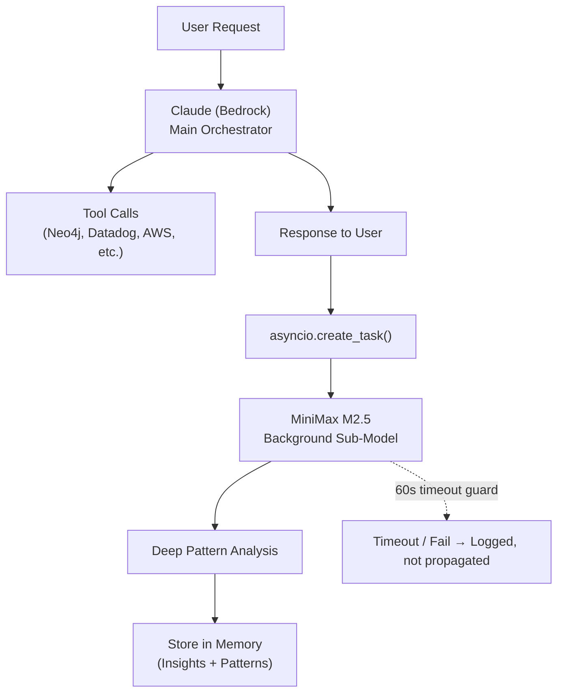

# Walkthrough: Dual-Model Agent Architecture

## Problem
- MiniMax agent went into continuous loop because `litellm` was **not installed**
- `_build_model()` tried MiniMax first → `ImportError` → exception → demo fallback (or retry loop)
- Bedrock model ID in [.env](file:///Users/spartan/Projects/NetForge-1/backend/.env) was invalid (`us.anthropic.claude-sonnet-4-5-20251001-v1:0` doesn't exist)
- Only one model could ever run — no dual-model architecture existed

## Changes Made

| File | Change |
|------|--------|
| [.env](file:///Users/spartan/Projects/NetForge-1/backend/.env) | Fixed `BEDROCK_MODEL_ID` to `anthropic.claude-3-5-sonnet-20241022-v2:0` |
| [requirements.txt](file:///Users/spartan/Projects/NetForge-1/backend/requirements.txt) | Added `litellm>=1.80.0` |
| [agent.py](file:///Users/spartan/Projects/NetForge-1/backend/agent/agent.py) | Full dual-model refactor (see below) |
| [test_connection.py](file:///Users/spartan/Projects/NetForge-1/backend/test_connection.py) | Comprehensive 5-test suite |

### Agent Architecture (New)

Key new functions in [agent.py](file:///Users/spartan/Projects/NetForge-1/backend/agent/agent.py):
- [_build_orchestrator_model()](file:///Users/spartan/Projects/NetForge-1/backend/agent/agent.py#192-205) — Always Bedrock Claude
- [_build_background_model()](file:///Users/spartan/Projects/NetForge-1/backend/agent/agent.py#207-233) — MiniMax M2.5 via LiteLLM (lazy singleton)
- [_run_minimax_background()](file:///Users/spartan/Projects/NetForge-1/backend/agent/agent.py#249-286) — Async with `asyncio.wait_for()` timeout
- [_fire_minimax_background()](file:///Users/spartan/Projects/NetForge-1/backend/agent/agent.py#288-344) — Fire-and-forget: parses MiniMax JSON, stores insights/patterns in memory

## Test Results

All **5/5 tests passed**:

| Test | Result | Details |
|------|--------|---------|
| Env vars | ✅ | All 9 keys loaded |
| Claude (Bedrock) | ✅ | 0.7s response time |
| MiniMax M2.5 | ✅ | 4.0s response time |
| Neo4j | ✅ | 10 services found |
| Full analysis | ✅ | 54.3s — Claude ran 8 tool calls, MiniMax async enriched memory |

MiniMax background task completed successfully after the main response, storing insights and patterns tagged with `[MiniMax]` prefix.
